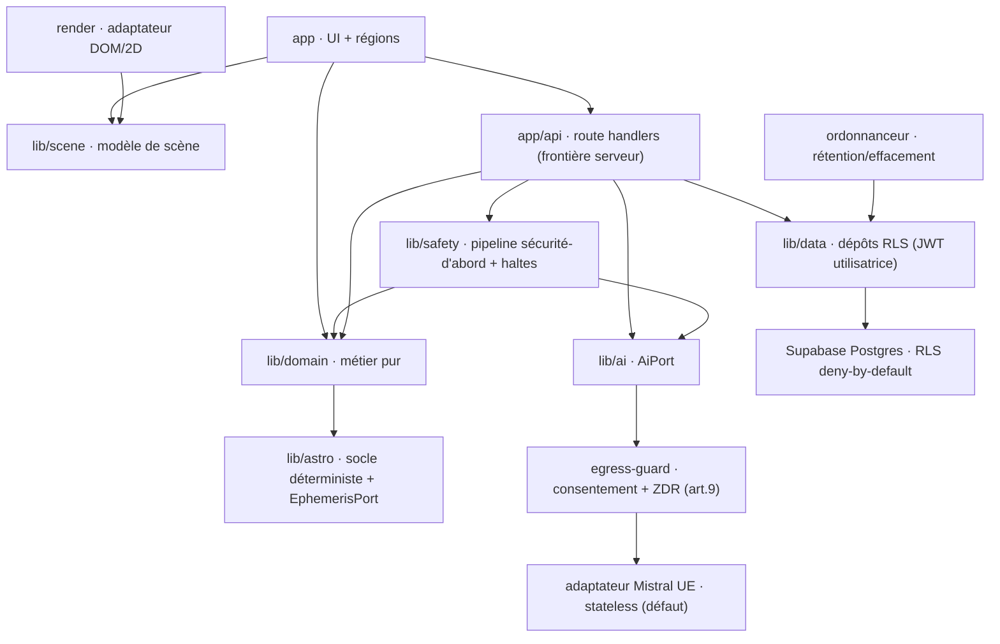
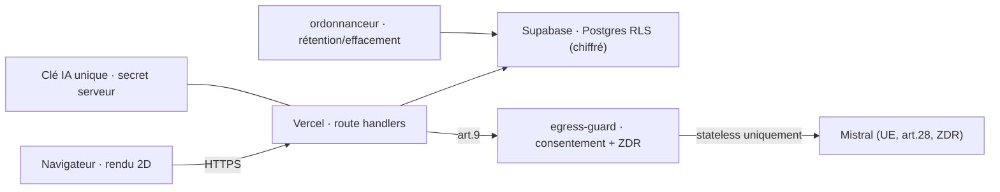
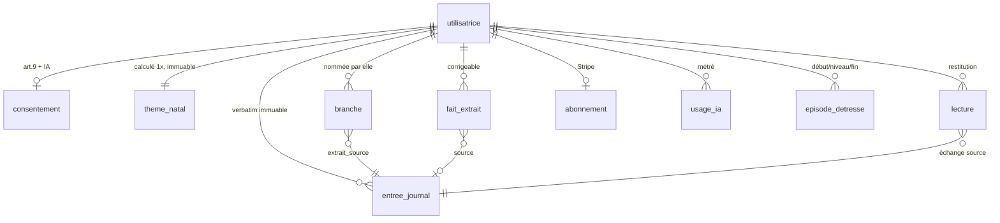
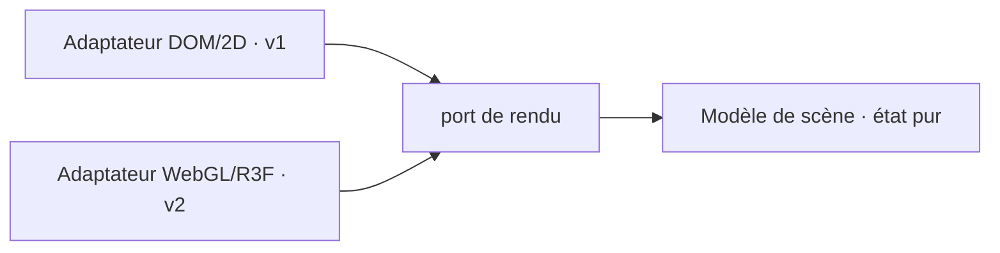

# Architecture Spine — Anam

## Design Paradigm

**Couches à ports gardés.** Cinq couches ; la dépendance ne va que du haut vers le bas (voir AD-10). Trois frontières sont franchies uniquement par un **port** (interface interne unique, adaptateur remplaçable) : le **fournisseur IA**, les **éphémérides**, le **rendu de scène**. Deux frontières transverses coupent les couches et ne se négocient jamais : la **frontière de données sensibles art.9** (AD-4, non contournable via AD-12/AD-13/AD-14) et la **frontière de déterminisme** socle/LLM (AD-6). Un axe dynamique est possédé de bout en bout : le **chemin de sécurité/détresse** passe par un **pipeline serveur unique** où la sécurité est évaluée d'abord (AD-16, AD-17).

| Couche | Dossier | Rôle |
|---|---|---|
| Vue / Rendu | `app/(scene)/`, `render/` | Régions de la scène ; adaptateur de rendu. Zéro logique métier. |
| Frontière serveur | `app/api/**/route.ts` | Seul point qui détient la clé IA et parle au fournisseur ; mutations ; métrage. |
| Domaine | `lib/domain/` | Logique métier pure : arc de séance, états de branche, mémoire. Zéro I/O. |
| Ports | `lib/ai/`, `lib/astro/`, `lib/scene/`, `lib/safety/` | Interfaces internes uniques + modèle de scène pur + détresse/haltes. |
| Adaptateurs / Données | `render/`, `lib/data/`, `supabase/` | Mistral, Supabase (RLS), rendu DOM/2D, migrations + politiques. |

## Invariants & Rules

### AD-1 — Paradigme en couches à dépendance descendante
- **Binds:** `all`
- **Prevents:** logique métier dispersée dans le rendu, I/O dans le domaine, appels croisés entre unités bâties séparément.
- **Rule:** toute unité appartient à une couche du tableau ci-dessus et n'importe que vers le bas (AD-10). Le domaine (`lib/domain/`) est pur : aucune dépendance à Next, Supabase, un SDK ou le rendu.

### AD-2 — IA médiée par le serveur `[ADOPTED]`
- **Binds:** NFR-019, NFR-022, NFR-002 ; toute capacité conversant avec l'IA (§1, §2, §5, §8).
- **Prevents:** clé exposée au client, appel navigateur→fournisseur en direct, usage non maîtrisé, chemin de données art.9 hors contrôle.
- **Rule:** le navigateur ne parle JAMAIS à un fournisseur IA. Tout appel passe par `app/api/**`. **Une seule** clé serveur, propriété de l'app (secret Vercel), jamais côté client, jamais une clé par utilisatrice. L'usage est métré par utilisatrice dans `usage_ia` (notre base), pas via des clés séparées. **Réexaminé et CONFIRMÉ le 2026-08-25 — voir « Note datée — AD-2 réexaminé » en fin de document : quatre motifs fournisseur relevés, la rupture de FR-043 qu'une clé par personne entraînerait, et les deux gardes de CI qui tiennent ce refus.**

### AD-3 — Abstraction de fournisseur IA `[ADOPTED]`
- **Binds:** NFR-012, NFR-019 ; §1 séance, §5 détresse, §8 synthèse.
- **Prevents:** verrouillage fournisseur, SDK Mistral disséminé dans l'applicatif.
- **Rule:** aucun code hors `lib/ai/adapters/` n'appelle un SDK fournisseur. L'applicatif ne connaît que le port `AiPort`. Défaut **Mistral**. Sur le chemin art.9, le port **ne lie que des adaptateurs UE éligibles** (AD-4) : la « bascule Opus » n'y est permise **que via une route Opus conforme UE** (Bedrock région UE, ou Anthropic résidence UE — DPA art.28 + ZDR), **jamais en direct-US**. Le choix du tier (AD-5) est un paramètre du port, jamais un `if` fournisseur.

### AD-4 — Frontière de données sensibles (art. 9) `[ADOPTED]`
- **Binds:** NFR-001, NFR-002, NFR-003, NFR-004, NFR-017, NFR-019, NFR-020, NFR-021, NFR-022 ; FR-012, FR-046, FR-067, FR-072.
- **Prevents:** fuite art.9 vers un traceur/analytics, fournisseur US direct sur art.9, STT non gouverné, adaptateur non-ZDR démarrant sur art.9, rétention non bornée chez un tiers, effacement non propagé.
- **Rule:** les données art.9 ne circulent que **serveur→fournisseur UE-éligible sous ZDR** ; jamais vers analytics, marketing ou traceur (aucun traceur tiers sur conversation/lecture/arbre/mémoire/aide). Accès base **RLS par utilisatrice, non contournable** (AD-12) ; chiffrement au repos + en transit. Conservation NFR-021 et effacement FR-067 : **moteur unique** (AD-14). Tout fournisseur art.9 est **sous-traitant art.28 + ZDR + endpoints stateless uniquement** (le ZDR exclut Agents/Conversations/batch/Le Chat) ; un adaptateur sans ZDR/DPA prouvés **refuse de démarrer** (échec dur, jamais dégradation). **Aucun direct-US** : OpenRouter/tout intermédiaire US interdits sur le chemin art.9 (toléré dev/test non sensible uniquement) ; la seule route non-UE admissible est un **mécanisme de transfert explicitement acté** (AD-3, NFR-019). La **détection ET la réponse de détresse** restent sur un fournisseur conforme. **Voix :** la transcription (STT) est un **sous-traitant art.9** (ou locale) sous les mêmes garanties ; **seule la transcription est conservée, l'audio supprimé** (NFR-003), **aucune inférence d'émotion depuis la voix** (NFR-004) ; **capture durable, indépendante du traitement — aucune entrée perdue** (NFR-017). Logs : jamais de contenu art.9 en clair (NFR-022) ; routes art.9 `no-store` + CSP stricte (voir Conventions).

### AD-5 — Tiering de modèles ; détresse au plus capable `[ADOPTED]`
- **Binds:** NFR-012, NFR-013 ; FR-024, §5, FR-066.
- **Prevents:** classification de détresse sous-dimensionnée, coût non maîtrisé, faux négatif de sécurité.
- **Rule:** deux tiers via `AiPort` — **léger** = échange courant ; **fort** = reconceptualisation (FR-024) + synthèse (FR-066). La **détection de détresse (§5) utilise TOUJOURS le modèle le plus capable disponible, JAMAIS le léger, en aucune circonstance.** Le tier est résolu côté serveur ; le client ne le choisit pas. Le choix du tier vit dans une **politique unique** `(capacité, niveau_sécurité) → tier`, jamais distribué chez chaque appelant : les appelants déclarent leur capacité, la politique résout. **Dès un niveau de détresse ≥ 1, le modèle le plus capable est forcé pour la DÉTECTION ET la RÉPONSE** de l'épisode, pas seulement la détection. À défaut du modèle fort : **repli sûr** (AD-15), jamais de dégradation vers le léger.

### AD-6 — Frontière de déterminisme ; thème natal calculé une fois `[ADOPTED]`
- **Binds:** NFR-011 ; FR-047, FR-010, FR-048, FR-049, FR-051, FR-053.
- **Prevents:** hallucination du socle, coût marginal par affichage, tronc qui « bouge ».
- **Rule:** le socle astro/numérologie est du **calcul pur** dans `lib/astro/`, **jamais un LLM** (NFR-011). Le **thème natal est calculé UNE FOIS à l'inscription puis stocké** (`theme_natal`, 1:1, immuable ; recalculé seulement si l'heure de naissance est ajoutée, FR-051). Les éphémérides sont derrière un port `EphemerisPort` (implémentation déférée — voir Deferred).

### AD-7 — Scène modèle/rendu séparés (cap 3D v2)
- **Binds:** NFR-018 ; EXPERIENCE (« la scène est une », régions, sans bord) ; FR-088, FR-031.
- **Prevents:** logique applicative soudée au DOM, réécriture obligée pour passer en 3D.
- **Rule:** l'état de la scène est un **modèle de données pur** dans `lib/scene/` (régions, cadrage, haltes) — il ne dépend jamais du rendu. Le rendu est un **adaptateur remplaçable** (`render/`, DOM/2D en v1 ; WebGL/R3F en v2 **sans réécriture**). **Aucune** logique applicative dans le rendu : l'état des branches (AD-8) est **projeté** par `lib/scene/` depuis l'état max persisté ; `render/` reste **muet** (ne décide ni ne garde aucune monotonie). Chaque région est atteignable au clavier/lecteur d'écran par un lien nommé (doublage non-spatial de rang égal).

### AD-8 — Mémoire à trois couches ; arbre monotone
- **Binds:** FR-062, FR-063, FR-064, FR-026, FR-027, FR-028, FR-029, FR-067, FR-046, FR-042.
- **Prevents:** perte de verbatim, branche décrétée par la machine, régression de l'arbre, branche née d'un épisode de détresse.
- **Rule:** trois couches distinctes — **journal brut** (`entree_journal`, verbatim, immuable), **faits extraits** (`fait_extrait`, profil vivant, corrigeable/supprimable), **branches** (`branche`, validées ET nommées par l'utilisatrice, datées, liées à `extrait_source_id`). L'arbre **dérive des branches** ; la transition `naissance→feuillaison→fruit` est **strictement monotone et gardée à la persistance** par une **fonction de transition unique possédée** (`lib/domain/`) **et une contrainte SQL** (CHECK/trigger) — le serveur ne régresse jamais l'état ; `lib/scene/` **projette** l'état max, `render/` reste **muet** (AD-7). La feuillaison (FR-028) est **progressive** : enum `etat` monotone **+** champ `intensite` continu, jamais un simple flip d'enum. **Seule exception : l'effacement (FR-067)**, qui prime sur FR-029 et se propage (AD-4). Le `fruit` n'est jamais inféré (geste explicite de l'utilisatrice). Aucune branche pendant un épisode + 72 h (FR-042), garde **au point d'écriture** (AD-16/AD-17). L'extrait source d'une branche ne peut être supprimé isolément. Faits extraits : provenance + tombstones, ré-extraction idempotente (AD-18).

### AD-9 — Les haltes toujours joignables ; jamais de paywall sur la sécurité
- **Binds:** FR-012, FR-013, FR-077, FR-043, FR-039, FR-044, FR-071.
- **Prevents:** filet de sécurité dépendant du classifieur, sollicitation commerciale pendant la détresse, consentement dissous dans le flux.
- **Rule:** consentement art.9 + déclaration IA (FR-012/013), ressources de détresse (FR-077) et mention IA persistante (FR-013) sont **accessibles indépendamment de toute détection**. `/aide` est atteignable **sans compte, sans paywall, sans traceur**. Dès le niveau 1, un drapeau serveur `limites_levees` est posé pour la durée de l'épisode : **le paywall, le bandeau de quota, la carte d'abonnement et le bilan refusent de se monter tant qu'il est vrai** (garde technique, FR-043) — y compris sur un compte gratuit à quota épuisé. Anam ne quitte jamais la conversation (FR-039). Épisodes exclus de toute analyse produit, synthèse et arbre (FR-046).

### AD-10 — Direction des dépendances
- **Binds:** `all` (arbitre AD-1, AD-2, AD-3, AD-6, AD-7).
- **Prevents:** cycles, remontée d'infrastructure dans le domaine, rendu qui pilote l'état.
- **Rule:** une flèche = « peut dépendre de ». Toute arête inverse est un défaut. `client → backend → fournisseur` (jamais `client → fournisseur`, AD-2). `rendu → modèle de scène` (jamais l'inverse, AD-7). `applicatif → port IA` (jamais un SDK, AD-3). Le domaine ne dépend de rien d'infra.



### AD-11 — Isolation du tirage de lecture
- **Binds:** FR-015, FR-016, FR-018, FR-019.
- **Prevents:** carte « choisie » servant un message prédéterminé (défaut critique FR-016), signification cataloguée fuitée à l'écran.
- **Rule:** le point d'entrée du tirage **n'a aucun accès** au profil, à l'historique ni à l'état émotionnel — contrainte d'architecture, pas de code. RNG uniforme, journalisé (graine + horodatage) pour audit ; **graine issue d'un CSPRNG système, jamais dérivée de l'identité/du profil/de l'historique** — l'identité ne sert qu'à l'écriture RLS de `lecture`, jamais comme entrée de sélection. Le catalogue de sens n'existe que côté serveur et n'a **aucune** représentation client avant la réponse de l'utilisatrice. La personnalisation vit dans la lecture (AD-3), jamais dans la sélection.

### AD-12 — Accès base lié à l'utilisatrice ; RLS non contournable
- **Binds:** NFR-001, NFR-022 ; FR-067 ; art.9 (AD-4).
- **Prevents:** fuite inter-locataires par `service_role`, RLS retombant sur un `WHERE user_id` oublié, table art.9 sans politique.
- **Rule:** tout accès au **contenu utilisateur** s'exécute sous l'identité de l'utilisatrice — client Supabase **porteur du JWT** (`auth.uid()`, RLS active) ; **jamais** via `service_role`/bypass RLS depuis un route handler. `service_role` est réservé aux **migrations et tâches système**, jamais au contenu art.9 en requête applicative. Toute table art.9 naît **RLS `deny-by-default`** ; une table art.9 sans politique est un **défaut de build** (test CI, voir Opérations).

### AD-13 — Garde de consentement art.9 : write-gate + egress-gate
- **Binds:** FR-012, FR-072 ; NFR-019, NFR-020 ; §5.
- **Prevents:** collecte art.9 avant consentement, envoi au fournisseur après une révocation en vol, egress hors ZDR, contexte art.9 mis en cache au-delà du point de contrôle.
- **Rule:** le consentement art.9 (FR-012) **précède** tout traitement. **Write-gate** — aucun dépôt sur une table art.9 sans `consentement` valide et non révoqué (FR-072), garde technique (pas UI). **Egress-gate** — tout envoi art.9 hors du système passe par un **point d'egress unique** (`lib/ai/egress-guard`) qui revérifie, **dans la même transaction que l'envoi**, `consentement = vrai` **ET** ZDR actif ; une **révocation en vol bloque** l'envoi et ne poste rien. La révocation bascule l'utilisatrice en « traitement art.9 suspendu ».

### AD-14 — Propriétaire unique de rétention & effacement
- **Binds:** NFR-021 ; FR-067, FR-071 ; art.9 (AD-4, AD-8).
- **Prevents:** « conservation automatique » sans mécanisme, effacement partiel, donnée art.9 survivant en cache/sauvegarde, résurrection par PITR.
- **Rule:** un **moteur unique** (jobs planifiés idempotents, voir Ordonnanceur) possède les durées NFR-021 — **inactivité 24 mois → notification → suppression 3 mois** ; **fermeture → 30 j** ; **minorité détectée (FR-071) → 30 j** — échéances **paramétrées** (jamais codées en dur), journalisées sans art.9 en clair, export proposé avant suppression. L'effacement (FR-067) est **exhaustif par utilisatrice** : il couvre **toute** ligne art.9 — `entree_journal`, `lecture`, `fait_extrait`, `branche`, `theme_natal`, `usage_ia`, `consentement`, `synthese`, résumé glissant — ainsi que les traces non-art.9 rattachées à la personne (`notification_envoyee`, `preference_courriel`), **purge les caches dérivés** et **se propage aux sous-traitants ET aux sauvegardes/PITR** dans une **fenêtre bornée** (voir Sauvegardes). Concilie AD-8 : le journal est **immuable en écriture courante mais effaçable** au titre du droit à l'effacement.

### AD-15 — Filet de sécurité hors-IA ; repli sûr
- **Binds:** FR-077, FR-039 ; §5 ; NFR-012.
- **Prevents:** filet dépendant du fournisseur IA, détection de détresse échouant en silence, personne en détresse laissée sans ressource, dégradation vers un modèle moindre en détresse.
- **Rule:** les **ressources de détresse (FR-077)** et la porte de secours (`/aide`) sont **statiques**, servies **sans dépendre du fournisseur IA** — modèle indisponible ⇒ la conversation dégrade gracieusement mais Anam **ne quitte jamais** (FR-039), tenu par ce filet non-IA. **Repli sûr explicite** : à défaut du modèle fort pour la détection (§5), le système **échoue vers la sécurité** — jamais d'analyse au tier léger (AD-5), il **force l'affichage des haltes** et pose `limites_levees` (AD-17) ; l'indisponibilité de sécurité est un **incident journalisé**, jamais un échec silencieux.

### AD-16 — Pipeline par message, sécurité d'abord
- **Binds:** §5 ; FR-042, FR-024, FR-046.
- **Prevents:** détresse et reconceptualisation non arbitrées sur le même message, branche proposée pendant un début d'épisode, garde 72 h rattachée à aucun point d'écriture.
- **Rule:** tout tour utilisateur passe par un **unique pipeline serveur ordonné** (`lib/safety/` → `lib/domain/`) : (1) l'**évaluation de sécurité s'exécute en premier** et peut **annuler** toute autre écriture du tour ; (2) au niveau ≥ 1, la sortie de reconceptualisation (FR-024) est **supprimée** pour l'épisode, pas seulement ignorée. La garde **« aucune branche pendant l'épisode + 72 h » (FR-042)** est appliquée **au point d'écriture de la branche** (`create-branche` interroge `episode_detresse`, AD-17), pas à la proposition. Aucun module n'appelle un détecteur hors de ce pipeline.

### AD-17 — L'épisode de détresse est une entité possédée
- **Binds:** §5 ; FR-042, FR-043, FR-046.
- **Prevents:** `limites_levees` à deux horloges, drapeau jamais éteint (paywall levé à vie) ou éteint trop tôt (paywall sur une personne encore en détresse).
- **Rule:** `episode_detresse` (utilisatrice, `debut`, `niveau_max`, `fin` nullable, `fenetre_expire_at`) est une **entité de première classe**. `limites_levees` **dérive** de `fin IS NULL` ; la fenêtre 72 h (FR-042) **dérive** de `fenetre_expire_at`. Une **transition d'extinction unique et possédée** ferme l'épisode selon un critère explicite (N tours sûrs consécutifs **ET** délai minimal) — **le paywall n'est jamais levé à vie**. Épisodes exclus de toute analyse/synthèse/arbre (FR-046) par une clause sur cette entité.

### AD-18 — Faits extraits : provenance, idempotence, tombstones
- **Binds:** FR-063, FR-064, FR-066 ; AD-8.
- **Prevents:** résurrection d'un fait supprimé par la ré-extraction ou la synthèse, double écrivain sans forme canonique.
- **Rule:** `fait_extrait` porte `origine` (`extrait|utilisatrice`), `statut` (`actif|corrige|supprime`) et une **clé de dédoublonnage stable**. L'extraction (post-tour, synthèse FR-066) est un **upsert idempotent** qui **ne réécrit ni ne ressuscite jamais** un fait `corrige`/`supprime` par l'utilisatrice — **la correction utilisatrice (FR-064) prime** (tombstone respecté). Propriétaire unique de la forme : `lib/domain/` (extraction et édition passent par la **même** fonction de merge).

## Consistency Conventions

| Concern | Convention |
|---|---|
| Naming | Tables/colonnes `snake_case` (Postgres) ; types/interfaces TS `PascalCase` ; ports suffixe `Port` (`AiPort`, `EphemerisPort`) ; adaptateurs `MistralAdapter` ; événements au passé (`branche_nommee`) ; fichiers `kebab-case`. |
| Data & formats | ids = `uuid` (v7 préféré, ordonnable) ; dates = ISO 8601 UTC, stockées `timestamptz` en UTC ; prix = Stripe, EUR, entiers centimes ; enveloppe d'erreur `{ code, message }` en **registre système, jamais signée Anam** ; état de branche = enum monotone `naissance\|feuillaison\|fruit` **+ `intensite` continue** (feuillaison progressive FR-028), jamais portée par la couleur seule (AD-8). |
| State & cross-cutting | Mutations uniquement via route handlers serveur ; auth = **Supabase passwordless** (FR-073), 18+ contrôlé techniquement (FR-069/070, NFR-023) ; isolation = **RLS par utilisatrice** (NFR-001) ; logs sans contenu art.9 en clair, accès admin aux contenus interdit par défaut, exception journalisée + notifiée (NFR-022) ; secrets **sensibles** serveur uniquement (clé IA, `service_role` — env Vercel), **à rotation documentée** ; clé **publishable** Supabase côté client par conception (AD-2, AD-12) ; paramètres produit lus à l'exécution, jamais codés en dur (ex. allocation résiduelle FR-079). |
| Événements externes | Handlers Stripe **idempotents par `provider_event_id`** (table `evenements_traites`) ; `abonnement` = projection à **écrivain unique** ; résiliation (FR-060) et remboursement (FR-089) **rejouables sans double effet**. |
| Métrage & paywall | Métrage IA = **tokens serveur écrits exactement une fois** par requête logique (clé d'idempotence), réconciliés à la fin/l'avortement du stream (NFR-014) ; `usage_ia` **sans art.9**. Le **paywall FR-014 est une offre au bilan, pas un verrou** ; la conversation ne se coupe qu'à épuisement de l'**allocation résiduelle FR-079**, jamais pendant `limites_levees` (AD-17). |
| Cache & versions | `theme_natal` **versionné** ; interprétations en cache (NFR-013) et projection du tronc **clés par version** ; le recalcul FR-051 **incrémente la version** et invalide les dépendants (AD-6). |
| Scène (partition) | `lib/scene/` sépare **view-state** client éphémère (région courante, cadrage — propriétaire unique de la transition de région) et **domain-projection** serveur en lecture seule (tronc, branches AD-8) ; le rendu n'écrit ni l'un ni l'autre (AD-7). |
| Routes art.9 | **`no-store`/`dynamic`** (jamais de cache CDN, NFR-020) ; **CSP stricte** — `connect-src` limité au backend Anam, toute origine tierce = **défaut de build** (NFR-002) ; **aucun moniteur d'erreurs/APM tiers** sur ces routes ; journalisation par **liste blanche de champs**, jamais prompt/réponse/verbatim (NFR-022). |

## Stack

| Name | Version |
|---|---|
| Node.js | ≥ 20.9 (plancher vérifié) · cible **22 LTS** |
| TypeScript | **5.9.3** — dernière 5.x stable (vérifiée npm 2026-07-22) ; **pas 7.0** (voir Deferred) |
| Next.js (App Router) | 16.2.x (vérifié 2026-07-22) |
| React | 19.2.x (vérifié 2026-07-22) |
| @supabase/supabase-js | 2.110.x (vérifié 2026-07-22) |
| Supabase (Postgres + Auth passwordless + RLS) | plateforme |
| stripe (node) | 22.3.x (vérifié 2026-07-22) |
| @mistralai/mistralai (derrière AD-3) | 2.5.x (vérifié) — **endpoints stateless uniquement** (ZDR, AD-4) |
| Vercel (hébergement + secrets serveur + Cron) | plateforme |
| Transcription vocale (`SttPort`) | **DÉFÉRÉ** — sous-traitant art.9 (AD-4) ou STT local ; voir Deferred |
| Éphémérides (`EphemerisPort`) | **DÉFÉRÉ** — voir Deferred |

## Structural Seed

```text
anima-app/
  app/                       # Next.js App Router — vue + frontière serveur
    (scene)/                 #   régions : accueil, anam, arbre, lecture
    api/**/route.ts          #   route handlers — SEUL point qui parle au fournisseur IA
    aide/                    #   /aide — halte ressources : sans compte, sans traceur
  lib/
    domain/                  # métier pur : arc de séance, états de branche, mémoire — 0 I/O
    scene/                   # modèle de scène — état pur, sans rendu
    ai/                      # AiPort + adapters/ (mistral, …)
    astro/                   # socle déterministe + EphemerisPort — calcul pur, jamais LLM
    safety/                  # détection de détresse + haltes + garde limites_levees
    data/                    # dépôts Supabase (RLS) — accès par utilisatrice
    config/                  # paramètres lus à l'exécution (FR-079)
  render/                    # adaptateur de rendu de scène (DOM/2D v1) — 0 logique métier
  supabase/                  # migrations SQL + politiques RLS
```

**Topologie & frontière art.9** (le chemin art.9 ne quitte jamais `serveur→Mistral/ZDR`) :



**Entités cœur** (attributs porteurs = AD, pas diagramme) :



**Scène modèle/rendu** (le modèle ne dépend jamais du rendu) :



## Opérations

**Environnements & migrations.** Un **projet Supabase par environnement** (dev/prod isolés) ; la **donnée prod ne rejoint jamais un env de dev** (invariant art.9). Migrations dans `supabase/` **forward-only**, nommées horodatées, appliquées en CI ; toute table art.9 arrive **RLS deny-by-default** (AD-12).

**Ordonnanceur.** Un **ordonnanceur unique** (Vercel Cron, ou pg_cron/Edge Functions Supabase) possède **tous** les mécanismes périodiques : les deux rythmes de notification (FR-033/034), la **rétention/effacement** (NFR-021, AD-14), la **synthèse périodique** (FR-066). Jobs **idempotents** ; aucun mécanisme périodique hors ordonnanceur.

**Sauvegardes & PITR.** Sauvegardes Supabase + **PITR à fenêtre bornée** ; la perte de base **n'est pas fatale** (restauration testée). **Réconciliation avec l'effacement (AD-14)** : fenêtre PITR **courte** OU **crypto-shredding** (clé par utilisatrice détruite à l'effacement), pour qu'une donnée effacée (FR-067) **ne survive pas** au-delà de la fenêtre ni ne **ressuscite** par restauration.

**Tests & CI/CD (bloquants).** Un logement de tests **bloque le déploiement** : (a) **jeu de cas de détresse** validé + **mesure des faux négatifs** — tout faux négatif est un incident (FR-078) ; (b) **contrôle automatisé voix & lexique** — formulations bannies de `anam-voice.md` (FR-085) + **lexique zéro médical** (NFR-008) ; (c) **uniformité vérifiable du tirage** sur grand N (FR-015/016) ; (d) **RLS deny-by-default** — toute table art.9 sans politique **casse le build** (AD-12). Chaque classification de sécurité (détresse, minorité) émet un **enregistrement d'audit sans art.9** (niveau, décision, tier, horodatage) pour mesurer le rappel.

**Observabilité & secrets.** Monitoring/alerting sur la **santé du classifieur** et l'**indisponibilité de sécurité** (incident, AD-15). **Rotation documentée** des secrets serveur (clé IA unique, `service_role`). **Aucun moniteur d'erreurs/APM tiers** sur les routes art.9 (voir Conventions).

## Capability → Architecture Map

| Capability / Area | Lives in | Governed by |
|---|---|---|
| Séance / conversation / voix Anam | `app/(scene)/`, `lib/domain/`, `lib/ai/` | AD-1, AD-3, AD-5 ; conventions voix |
| Socle calculé (thème, nombres, horoscope, ennéagramme) | `lib/astro/` | AD-6, NFR-011 |
| Tirage & lecture | route handler isolé, `lib/domain/`, `lib/ai/` | AD-11, AD-3 |
| Arbre & branches | `lib/domain/`, `lib/scene/`, `render/` | AD-8, AD-7 |
| Mémoire (journal / faits / branches, export / suppression) | `lib/data/`, `lib/domain/` | AD-8, AD-4 (FR-067) |
| Détresse, haltes, `/aide` | `lib/safety/`, `app/aide/` | AD-9, AD-5 |
| Consentement art.9 + déclaration IA | `app/` (halte), `lib/data/` | AD-9, AD-4 (FR-012/013) |
| Paywall / abonnement / résiliation | `app/`, Stripe, `lib/safety/` (garde) | AD-9 (FR-043), conventions |
| Notifications (socle quotidien / Anam rare) | web push + **Ordonnanceur** (Opérations) | AD-9, NFR-015, FR-033/034 |
| Scène & navigation régions | `lib/scene/`, `render/` | AD-7, AD-10 |
| Usage IA métré | `lib/data/` (`usage_ia`), route handlers | AD-2 |
| Pipeline détresse / reconceptualisation | `lib/safety/`, `lib/domain/` | AD-16, AD-17, AD-5 |
| Egress art.9 (consentement / ZDR) | `lib/ai/egress-guard` | AD-13, AD-4 |
| Voix / transcription | `SttPort`, `lib/ai/` | AD-4 (NFR-003/004/017) |
| Rétention / effacement / sauvegardes | ordonnanceur, `lib/data/` | AD-14, Opérations |
| Tests & gates (détresse, voix, tirage, RLS) | CI | Opérations, AD-16, AD-12 |

## Deferred

- **Vrai 3D / WebGL** (v2, étoile du nord) — AD-7 rend l'adaptateur remplaçable ; v1 reste 2D.
- **Licence éphémérides** — `sweph` **ET** `sweph-wasm` sont **AGPL-3.0** (copyleft réseau, art.13 : une SaaS proprio devrait tout ouvrir — **pas un contournement**). Options réelles : (a) **licence pro Swiss Ephemeris — 700 CHF** (paiement unique, illimité) ; (b) une lib **réellement permissive mais moins précise** (moteur distinct, ex. `astronomy-engine` MIT — maisons/features à valider). Contournement acté : calcul 1× puis stocké (AD-6) ; choix final derrière `EphemerisPort`. **Porte pré-lancement.**
- **DPA art.28 + ZDR Mistral payant** (plan Scale) — **porte pré-lancement** : requis avant toute vraie donnée art.9 ; les clés Mistral gratuites actuelles ne le couvrent pas (dev/test uniquement).
- **Pool de clés IA** (scaling débit) — AD-2 tient avec une clé unique en v1.
- **Composition spatiale fine de la scène** (chorégraphie, ampleur de cadrage, parallaxe) — hors modèle ; sous contrainte accessibilité + `prefers-reduced-motion`.
- **Validation clinique + juridique du protocole de détresse** (PRD §5) — porte pré-lancement.
- **Détail interne des premium** (ancrages, plans d'étapes, synthèse — FR-081) — coquille comportementale fixée, contenu à spécifier.
- **TypeScript 7 (compilateur natif)** — upgrade futur ; 7.0.2 GA le 2026-07-08, trop frais pour épingler le build v1 ; rester sur 5.x jusqu'à maturité de l'outillage.
- **Fournisseur STT** — sous-traitant art.9 (AD-4) ou STT local, derrière `SttPort` ; **porte pré-lancement** avant art.9 réel.
- **Portes de conformité pré-lancement** — **AIPD (NFR-005)** et **procédure de notification de violation art.33-34 (NFR-022)**, en sus du DPA/ZDR Mistral et de la validation clinique+juridique de la détresse.
- **Durcissement accès admin (NFR-022)** — rendre « accès admin interdit par défaut » techniquement vrai : **break-glass audité** OU **chiffrement applicatif du contenu art.9 par utilisatrice** (clés hors de portée de l'admin base). **Tranché avant art.9 réel** — non fermé par un invariant en v1.

---

## Note datée — AD-2 réexaminé le 2026-08-25 : pourquoi jamais une clé par utilisatrice `[CONFIRMÉ]`

> ⚠️ **Cette note est APPENDUE À LA FIN, et ce n'est pas une question de mise en page.** Une
> vingtaine de citations `SPINE:<ligne>` vivent dans `epics.md`, dans les artefacts
> d'implémentation et dans `deferred-work.md` — `:44`, `:54`, `:123`, `:153`, `:266-277`. Insérer
> ces lignes sous AD-2 les aurait toutes décalées **en silence** : chaque référence aurait continué
> de pointer quelque part, simplement plus vers ce qu'elle nommait. Une citation qui se trompe sans
> rougir est pire qu'une citation cassée. La règle d'AD-2 (ligne 44) porte donc un renvoi ici, écrit
> **sans ajouter de ligne**.

**La demande.** « Une clé API Mistral par utilisatrice, pour savoir ce que chacune me coûte »
(Julian, 2026-08-25). **Refusée.** AD-2 la refusait déjà mot pour mot il y a un an — « **jamais une
clé par utilisatrice**. L'usage est métré par utilisatrice dans `usage_ia` (notre base), **pas via
des clés séparées** ». Ce qui suit ne rouvre pas la décision : il l'**instruit**, pour qu'elle ne se
rouvre pas une troisième fois.

### Ce que le fournisseur permet réellement — relevé du 2026-08-25

Une décision fournisseur sans date de relevé est un défaut : chacun de ces quatre points porte la
sienne, et devra être revérifié avant d'être réutilisé comme argument.

1. **Aucun suivi de coût par clé.** La granularité de l'API *Usage Metrics* est
   user / agent / workspace / organisation — et « user » y désigne un **siège humain** de
   l'organisation, pas une cliente du produit. Une clé par utilisatrice ne rendrait donc **même pas**
   le chiffre demandé.
2. **Les plafonds s'appliquent au *workspace*, pas à la clé** — et un plafond atteint **suspend
   l'accès API jusqu'au mois suivant**.
3. **500 workspaces actifs maximum par organisation.** Un workspace par utilisatrice bute sur un mur
   dur à cinq cents comptes.
4. **L'Admin API est en Preview, réservée au plan Enterprise**, quand le produit est sur **Scale**
   (`lib/ai/adapters/mistral.ts:24`). Provisionner des clés par programme n'est pas à notre portée.

### La conséquence produit, qui est plus grave que la conséquence technique

Le point 2 n'est pas un désagrément d'exploitation : c'est une rupture de FR-043.

Un plafond de workspace fait passer **la décision de couper chez le fournisseur** — hors de portée
du serveur, sans contexte, et potentiellement **au milieu d'une conversation en détresse**. Or
FR-043 (`prd.md:135`) dit qu'« aucune limite d'usage ne peut interrompre une conversation en
détresse, y compris et surtout sur un compte ayant épuisé son quota », et tout le code le protège
avec soin : `lib/domain/allocation-residuelle.ts:47-48` place les deux court-circuits
(`niveauSecurite > 0`, `limitesLevees`) **en tête** de `doitCouperConversation`, précisément pour que
la coupure ne puisse jamais atteindre quelqu'un qui va mal.

Déléguer la coupure à un plafond de facturation détruirait cette garantie sans qu'aucune ligne du
dépôt ne change — donc sans qu'aucun test ne rougisse. C'est le motif décisif du refus.

### Ce qui reste admissible

Le **pool de clés pour le DÉBIT** (`Deferred`, « Pool de clés IA ») : N clés partagées par le
serveur, choisies pour répartir la charge, **jamais adossées à une identité**, **jamais stockées en
base**, toutes couvertes par le même DPA art. 28 + ZDR. C'est un geste d'échelle, pas de mesure — il
ne dit rien du coût de personne, et c'est justement ce qui le rend acceptable.

### Les passerelles à « clés virtuelles » — et l'éliminatoire de chacune

- **OpenRouter** — **interdit par écrit** sur le chemin art. 9 (AD-4 : « aucun direct-US,
  OpenRouter/tout intermédiaire US interdits »). Éliminé sans examen.
- **Portkey** (Palo Alto Networks depuis mai 2026) et **Helicone** (Mintlify, mode maintenance
  depuis mars 2026) — chacun exigerait une entrée de **sous-traitant art. 28 + ZDR** dans
  `lib/domain/sous-traitants.ts`, donc un contrat, une AIPD reprise, et un intermédiaire de plus sur
  le chemin le plus sensible du produit.
- **LiteLLM auto-hébergé** — le seul candidat défendable : pas d'intermédiaire, pas de contrat neuf.
  Mais il coûte **un Postgres et un service à opérer** pour reproduire une table de neuf colonnes
  **déjà écrite, déjà métrée par personne et par sous-appel, déjà testée** (`usage_ia`, Story 2.1) —
  et que personne n'a encore jamais lue. Le manque n'a jamais été l'infrastructure : c'est un prix,
  deux appels non métrés et une lecture. Voir Epic 10, Stories 10.3, 10.5 et 10.6.

### Ce qui garde cette décision

Le refus ne vit pas seulement dans ce document : `tests/frontiere-serveur.test.ts` échoue si une clé
de fournisseur devient lisible depuis la base (aucune colonne, aucun `select` portant `cle_api`,
`api_key` ou `token_fournisseur` hors de `lib/ai/adapters/`), et si l'attestation de conformité au
démarrage (`assertConformiteArt9`) devient paramétrable par requête, par session ou par ligne de
base. Ces deux gardes sont la forme exécutable de cette note — un document ne se défend pas seul.
